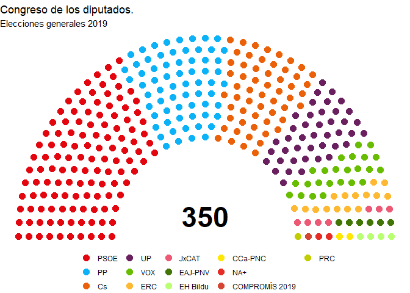
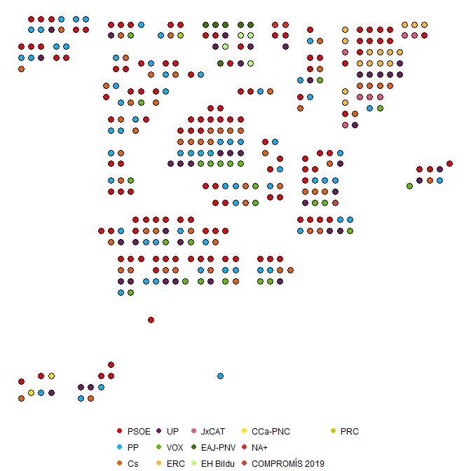
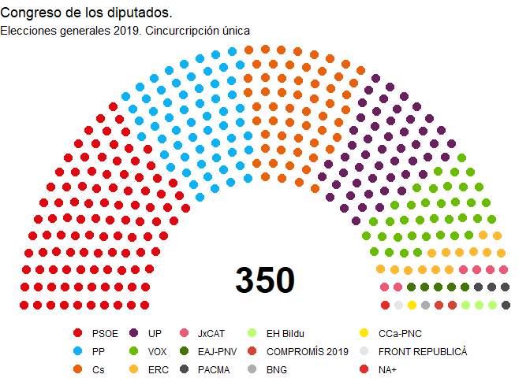
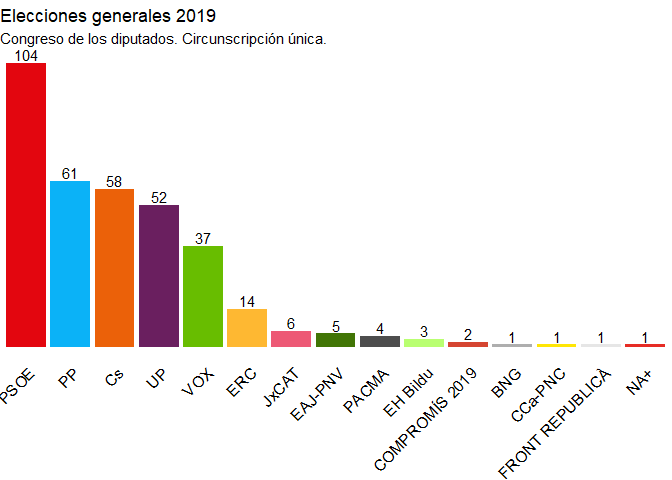
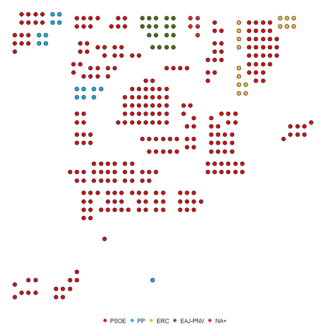
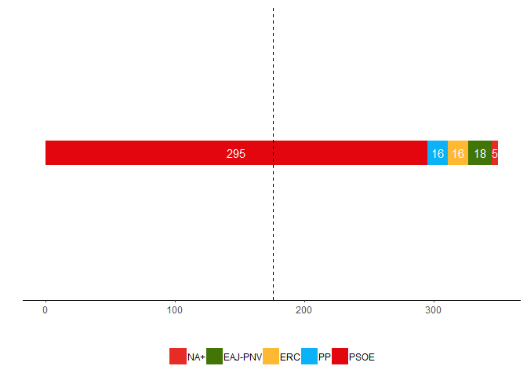
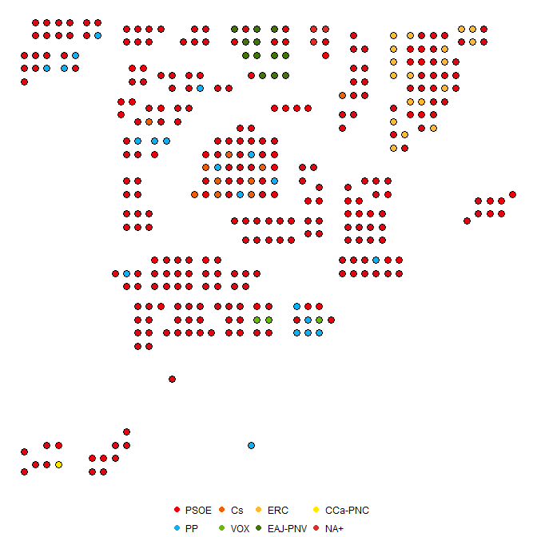
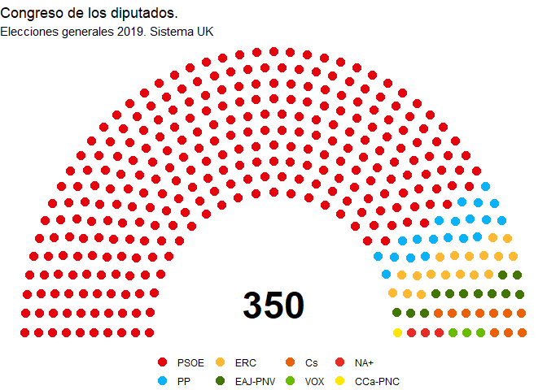
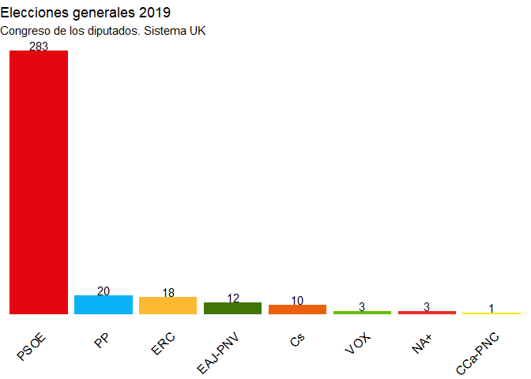

Este 28 de abril de 2019 se celebraron en España elecciones generales
para elegir los representantes al congreso y senado de la XII
legislatura. Los miembros del congreso se eligen mediante un sistema de
representación proporcional. El número actual de representantes es de
350 diputados \[[Ley Orgánica del Régimen Electoral
General](https://es.wikipedia.org/wiki/Legislaci%C3%B3n_electoral_espa%C3%B1ola)\]

Existen 52 circunscripciones electorales para el Congreso de los
Diputados, que se corresponden con las cincuenta provincias españolas
más las ciudades autónomas de Ceuta y Melilla. Según la ley electoral
española cada provincia tiene garantizado un mínimo de partida de dos
escaños y las ciudades autónomas de Ceuta y Melilla, uno cada una de
ellas. Los otros 248 diputados se asignan de forma proporcional a la
población de derecho. Los escaños a las listas electorales en cada
circunscripción se reparten usanso el sistema D’Hondt en cada
circunscripción.

Los resultados provisionales pueden consultarse en la
[web](https://resultados.eleccionesgenerales19.es/Congreso/Total-nacional/0/es)
que el Ministerio del Interior ha creado al efecto.

Quise aprovechar para utilizar el paquete
[\#ggparliament](https://github.com/RobWHickman/ggparliament) y replicar
los resultados.

 

 
Repartidos por circunscripciones quedaría distribuida de la siguiente
manera

En forma de gráfico de barras

Cambiando las reglas del juego
==============================

Siempre he querido experimentar como hubiesen sido los resultados con
otros sistema de reparto como el de circunscripción único (lo que
equivaldría a que el peso de un voto sería el mismo para todas las
provincias) o incluso si utilizasen los sistemas empleados en otros
países para la elección de representantes, como el de Reino Unido, o de
presidente, como el de Estados Unidos.

Cincunscripción única
---------------------

En este caso suponemos que existe una única cincuscripción para toda
Espña. De esta forma, se aplicaría el sistema de reparto d’Hont para los
votos de los diferentes partidos obtenidos en toda España. El parlamento
quedaría formado de la siguiente manera.

 En
forma de gráfico de barras

## Sistema de elecciones presidenciales en los Estados Unidos.

Hay que recordar que en las elecciones generales en España los electores
no eligen presidente sino representantes para el Congreso y el Senado.
Es en la investidura donde el Parlamento reconoce y acepta al nuevo
presidente del Gobierno. En Estados Unidos el presidente se elige de
forma indirecta. Cada Estado tiene asignado un número de compromisarios,
que son los que realmente se eligen en las elecciones presidenciales y
que mediante sus votos (votos electorales) eligen presidente. La mayoría
de Estados conceden todos sus votos electorales al candidato que gana la
mayoría absuluta de los votos emitidos por los ciudadanos. Es decir, es
un sistema de todo o nada. El que partido qeu gana se queda con todos
los compromisarios de ese Estado.

Extrapolando este sistema al caso español, podríamos equiparar cada de
las 50 cicunscripciones como un Estado de lso Esatdos Unidos y el número
de compromisarios con el número de escaños asigandos a dicha
circunscripción. De esta manera, el partido que gana esa circunscripción
se lleva todos los escaños (compromisarios) asociados a esa
circunscripción. El mapa quedaría configurado de la siguiente manera.

El PSOE tendría más de 176 compromisarios, por lo que Sánchez sería
elegido Presidente del Gobierno sin necesidad de pactos.

Sistema de elección al parlamento en el Reino Unido
---------------------------------------------------

En este caso, las circunscripciones son mucho más pequeñas y el
representante se elige por escrutino uninominal mayoritario. Es decir,
quien gana en ese distrito es designado miembro del parlamento. Para
poder hacer la analogía, he supuesto que cada uno de los escaños para
cada provincia se corresponda con los municipios más poblados de esa
circunscripción. Por ejemplo, para A Coruña con 8 escaños sus
representantes saldrán de los partidos más votados en los 8 municipios
más poblados.

El mapa electoral de España quedaría dibujado de la siguiente manera:

El parlamento quedaría configurado de la siguiente manera:

En forma de gráfico de barras

**Código utilizados para la generación de los gráficos en **
